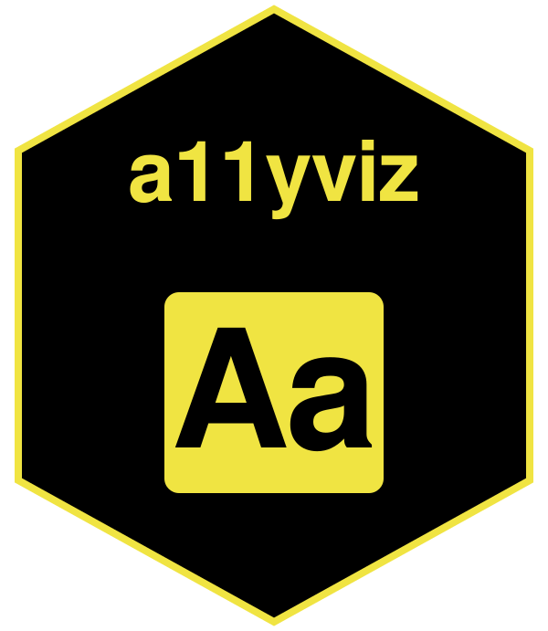

[](https://github.com/mshin77/a11yviz/actions)
[](https://www.repostatus.org/#active)
[](https://opensource.org/licenses/MIT)

Makes charts and documents accessible across
[ggplot2](https://ggplot2.tidyverse.org/),
[plotly](https://plotly.com/r/), and [Quarto](https://quarto.org/),
aligned with the [Web Content Accessibility Guidelines
(WCAG 2.1)](https://www.w3.org/TR/WCAG21/). Includes WCAG-tagged
palettes, alt-text scaffolds, audits, a document rubric, heading and
reading-level checks, `shiny` ARIA helpers, and a stylesheet for `DT`
and `DiagrammeR`.

Python version: [a11yviz](https://github.com/mshin77/a11yviz-py).

## Installation

From [R-universe](https://mshin77.r-universe.dev) (pre-built binaries
for Windows, macOS, and Linux):

    install.packages("a11yviz",
      repos = c("https://mshin77.r-universe.dev", "https://cloud.r-project.org"))

Or the development version from
[GitHub](https://github.com/mshin77/a11yviz):

    install.packages("remotes")
    remotes::install_github("mshin77/a11yviz")

## Quick start

```r
library(ggplot2)
library(palmerpenguins)
library(a11yviz)

p <- ggplot(na.omit(penguins),
            aes(flipper_length_mm, body_mass_g,
                color = species, shape = species)) +
  geom_point() +
  scale_color_a11y("dark2_8") +
  labs(x = "Flipper length (mm)", y = "Body mass (g)")

a11y_alt_text(p, "Scatter of penguin body mass vs flipper length by species.")
```

## Citation

Shin, M. (2026). *a11yviz: Accessibility toolkit for ggplot2, plotly, and
Quarto* (R package version 0.1.4). <https://mshin77.github.io/a11yviz>

Shin, M. (2026). *a11yviz: Accessibility toolkit for plotnine, plotly,
and Quarto* (Python package version 0.1.4). <https://github.com/mshin77/a11yviz-py>
