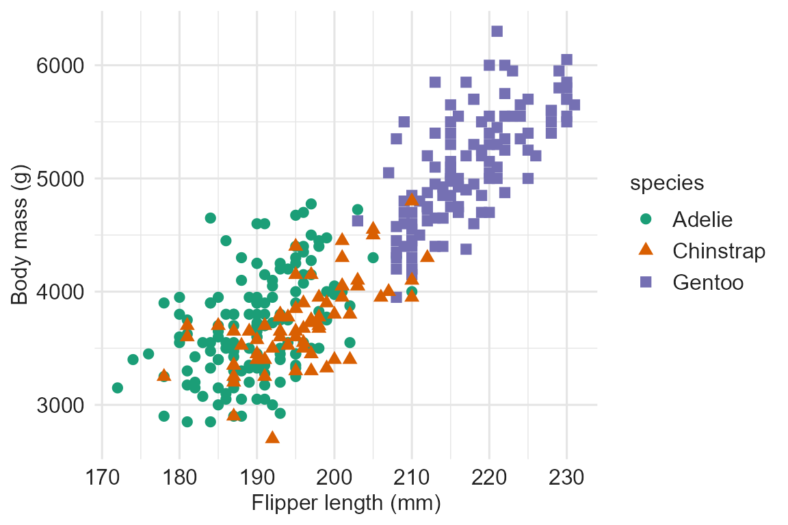

# Getting started with a11yviz (R)

``` r
library(a11yviz)
library(ggplot2)
library(palmerpenguins)
#> 
#> Attaching package: 'palmerpenguins'
#> The following objects are masked from 'package:datasets':
#> 
#>     penguins, penguins_raw
penguins <- na.omit(penguins)

dt_show <- function(df) DT::datatable(df,
  extensions = "Buttons",
  options    = list(dom        = "Bfrtip",
                    buttons    = c("copy", "csv", "excel", "pdf"),
                    pageLength = 10,
                    scrollX    = TRUE,
                    autoWidth  = TRUE),
  class      = "compact stripe hover",
  rownames   = FALSE,
  width      = "100%")
```

## Example

``` r
p <- ggplot(penguins, aes(flipper_length_mm, body_mass_g, color = species)) +
  geom_point() +
  labs(x = "Flipper length (mm)", y = "Body mass (g)")
p
```


## Audit reveals the gaps

[`a11y_audit()`](https://mshin77.github.io/a11yviz/reference/a11y_audit.md)
returns one row per WCAG criterion with a status column. The table below
filters to **actionable** rows (`status = "todo"` or `"ok"`) — the items
where the chart needs human attention.

| status | meaning |
|----|----|
| `ok` | check passes automatically |
| `todo` | needs user action |
| `applied` | handled by [`theme_a11y()`](https://mshin77.github.io/a11yviz/reference/theme_a11y.md) / [`scale_color_a11y()`](https://mshin77.github.io/a11yviz/reference/scale_a11y.md) / [`a11y_layout()`](https://mshin77.github.io/a11yviz/reference/a11y_layout.md) |
| `manual` | requires human review (e.g., reflow at 320 px) |
| `css` | covered by [`a11y_css()`](https://mshin77.github.io/a11yviz/reference/a11y_css.md) stylesheet |
| `doc` | document-level check; run [`a11y_check_headings()`](https://mshin77.github.io/a11yviz/reference/a11y_check_headings.md) separately |
| `n/a` | not applicable to this chart type (e.g., hover on ggplot) |

``` r
dt_show(subset(a11y_audit(p), status %in% c("todo", "ok")))
```

Two actionable items come back as `todo`:

- WCAG 2.1: alt text missing
- WCAG 2.1: redundant group encoding (color only)

## Improved

``` r
p_a11y <- ggplot(penguins, aes(flipper_length_mm, body_mass_g,
                               color = species, shape = species)) +
  geom_point() +
  theme_a11y() +
  scale_color_a11y("dark2_8") +
  labs(x = "Flipper length (mm)", y = "Body mass (g)")
p_a11y <- a11y_alt_text(p_a11y,
  "Scatter of penguin body mass vs flipper length by species; Gentoo cluster at long flippers and high body mass.")
p_a11y
```



Four accessibility wins from a few extra lines: `shape = species`
encodes group via marker shape (Success Criterion 1.4.1),
`scale_color_a11y("dark2_8")` swaps in WCAG-tagged colors that clear 3:1
on white (Success Criterion 1.4.11),
[`theme_a11y()`](https://mshin77.github.io/a11yviz/reference/theme_a11y.md)
applies the recommended font sizes and axis styling (Success Criterion
1.4.4), and
[`a11y_alt_text()`](https://mshin77.github.io/a11yviz/reference/a11y_alt_text.md)
attaches the screen-reader description (Success Criterion 1.1.1).

## Audit again

``` r
dt_show(subset(a11y_audit(p_a11y), status %in% c("todo", "ok")))
```

All actionable checks come back as `ok`.

## WCAG rubric

[`a11y_rubric()`](https://mshin77.github.io/a11yviz/reference/a11y_rubric.md)
is the per-criterion reference: name, level, threshold, and the
`a11yviz` function that addresses each. Same `criterion` column as
[`a11y_audit()`](https://mshin77.github.io/a11yviz/reference/a11y_audit.md),
so the two join cleanly.

``` r
dt_show(a11y_rubric())
```

## Accessible CSS

[`a11y_css()`](https://mshin77.github.io/a11yviz/reference/a11y_css.md)
returns the path to a stylesheet that handles dark-mode tooltips,
keyboard focus rings, table styling, and responsive layout.
`a11y_css("shiny")` also returns the path to the Shiny add-on with
skip-link, reduced-motion, and high-contrast rules.

``` r
basename(a11y_css())
#> [1] "a11yviz.css"
```

## Playground

[`run_app()`](https://mshin77.github.io/a11yviz/reference/run_app.md)
launches a local Shiny playground (mirrors the Python
`a11yviz.run_app()`). Two tabs compare a baseline ggplot chart against
the a11y-improved version with paired audit tables; toggle between WCAG
AA and AAA in the sidebar. Requires `shiny`, `bslib`, and `DT`.

``` r
run_app()
```

## More features

- **Palettes** —
  [`a11y_palette_list()`](https://mshin77.github.io/a11yviz/reference/a11y_palette_list.md)
  enumerates discrete, diverging, and sequential palettes with WCAG
  metadata.
  [`a11y_palette()`](https://mshin77.github.io/a11yviz/reference/a11y_palette.md),
  [`a11y_palette_div()`](https://mshin77.github.io/a11yviz/reference/a11y_palette_div.md),
  [`a11y_palette_seq()`](https://mshin77.github.io/a11yviz/reference/a11y_palette_seq.md)
  resolve hex codes; `scale_*_a11y_*()` apply them in ggplot.
- **Plotly** —
  [`a11y_layout()`](https://mshin77.github.io/a11yviz/reference/a11y_layout.md)
  applies accessible chrome, fonts, and colorway.
  [`a11y_ggplotly()`](https://mshin77.github.io/a11yviz/reference/a11y_ggplotly.md)
  converts a ggplot to plotly with alt text preserved.
- **Document-level checks** —
  [`a11y_check_headings()`](https://mshin77.github.io/a11yviz/reference/a11y_check_headings.md)
  and
  [`a11y_check_readability()`](https://mshin77.github.io/a11yviz/reference/a11y_check_readability.md)
  flag heading-skip and reading-level issues in `.qmd` / `.Rmd` / `.md`
  files.
- **Live-region announcements** —
  [`a11y_announce()`](https://mshin77.github.io/a11yviz/reference/a11y_announce.md)
  wraps a status message in a live region for screen-reader-only
  announcement.
- **Alpha guidance** —
  [`a11y_alpha_presets()`](https://mshin77.github.io/a11yviz/reference/a11y_alpha_presets.md)
  returns sensible alpha values for overlay layers; verify composited
  contrast with `a11y_check_palette(alpha = ...)`.

See the [function
reference](https://mshin77.github.io/a11yviz/articles/r-reference.md)
for the full API.

## References

- Crameri, F., Shephard, G. E., & Heron, P. J. (2020). The misuse of
  colour in science communication. *Nature Communications*, 11, 5444.
- Nuñez, J. R., Anderton, C. R., & Renslow, R. S. (2018). Optimizing
  colormaps with consideration for color vision deficiency to enable
  accurate interpretation of scientific data. *PLoS ONE*, 13(7),
  e0199239.
- [WCAG 2.1 specification](https://www.w3.org/TR/WCAG21/) — pass any
  `criterion` value to
  [`a11y_wcag_url()`](https://mshin77.github.io/a11yviz/reference/a11y_wcag_url.md)
  for the deep link.
- [ADA web guidance](https://www.ada.gov/resources/web-guidance/)
