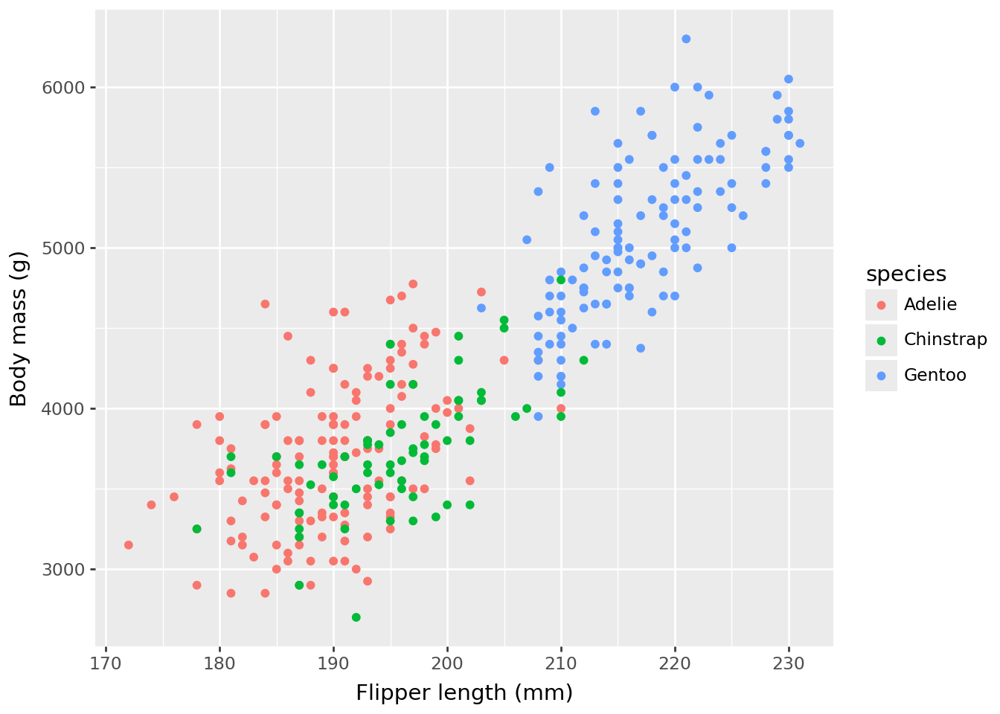
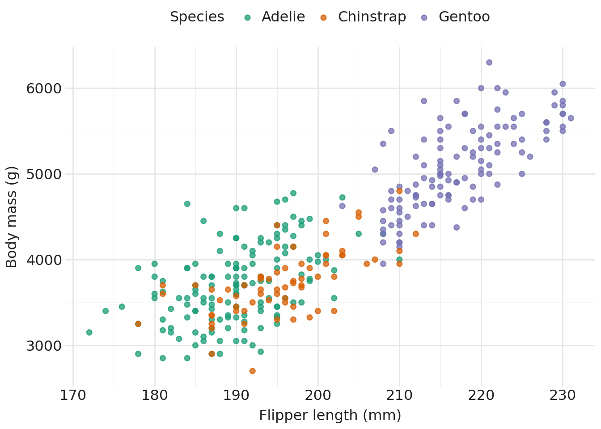

# Getting started with a11yviz (Python)

``` python
import a11yviz
import pandas as pd
from itables import show
from plotnine import aes, geom_point, ggplot, labs, theme
from plotnine.data import penguins

penguins = penguins.dropna()

dt_options = dict(
    buttons=["copy", "csv", "excel", "pdf"],
    pageLength=10,
    scrollX=True,
    autoWidth=True,
    classes="compact stripe hover",
)
```

## Example

``` python
p = (
    ggplot(penguins, aes("flipper_length_mm", "body_mass_g", color="species"))
    + geom_point()
    + labs(x="Flipper length (mm)", y="Body mass (g)")
)
p
```



## Audit reveals the gaps

[`a11y_audit()`](https://mshin77.github.io/a11yviz/reference/a11y_audit.md)
returns one row per WCAG criterion with a status field. The table below
filters to **actionable** rows (`status = "todo"` or `"ok"`) — the items
where the chart needs human attention.

| status | meaning |
|----|----|
| `ok` | check passes automatically |
| `todo` | needs user action |
| `applied` | handled by [`theme_a11y()`](https://mshin77.github.io/a11yviz/reference/theme_a11y.md) / `scale_*_a11y()` / [`a11y_layout()`](https://mshin77.github.io/a11yviz/reference/a11y_layout.md) |
| `manual` | requires human review (e.g., reflow at 320 px) |
| `css` | covered by [`a11y_css()`](https://mshin77.github.io/a11yviz/reference/a11y_css.md) stylesheet |
| `doc` | document-level check; run [`a11y_check_headings()`](https://mshin77.github.io/a11yviz/reference/a11y_check_headings.md) separately |
| `n/a` | not applicable to this chart type (e.g., hover on plotnine) |

``` python
audit_p = a11yviz.a11y_audit_chart(p)
print(a11yviz.a11y_audit_summary(audit_p))
show(pd.DataFrame(a11yviz.a11y_audit_actionable(audit_p)),
     table_id="audit-example", **dt_options)
```

    2 to do, 0 ok, 4 already handled.

|  |
|:---|
| [![](data:image/svg+xml;base64,PHN2ZyBjbGFzcz0ibWFpbi1zdmciIHhtbG5zPSJodHRwOi8vd3d3LnczLm9yZy8yMDAwL3N2ZyIgeGxpbms9Imh0dHA6Ly93d3cudzMub3JnLzE5OTkveGxpbmsiIHdpZHRoPSI2NCIgdmlld2JveD0iMCAwIDUwMCA0MDAiIHN0eWxlPSJmb250LWZhbWlseTogJiMzOTtEcm9pZCBTYW5zJiMzOTssIHNhbnMtc2VyaWY7Ij48ZyBzdHlsZT0iZmlsbDojZDlkN2ZjIj48cGF0aCBkPSJNMTAwLDQwMEg1MDBWMzU3SDEwMFoiIC8+PHBhdGggZD0iTTEwMCwzMDBINDAwVjI1N0gxMDBaIiAvPjxwYXRoIGQ9Ik0wLDIwMEg0MDBWMTU3SDBaIiAvPjxwYXRoIGQ9Ik0xMDAsMTAwSDUwMFY1N0gxMDBaIiAvPjxwYXRoIGQ9Ik0xMDAsMzUwSDUwMFYzMDdIMTAwWiIgLz48cGF0aCBkPSJNMTAwLDI1MEg0MDBWMjA3SDEwMFoiIC8+PHBhdGggZD0iTTAsMTUwSDQwMFYxMDdIMFoiIC8+PHBhdGggZD0iTTEwMCw1MEg1MDBWN0gxMDBaIiAvPjwvZz48ZyBzdHlsZT0iZmlsbDojMWExMzY2O3N0cm9rZTojMWExMzY2OyI+PHJlY3QgeD0iMTAwIiB5PSI3IiB3aWR0aD0iNDAwIiBoZWlnaHQ9IjQzIj48YW5pbWF0ZSBhdHRyaWJ1dGVuYW1lPSJ3aWR0aCIgdmFsdWVzPSIwOzQwMDswIiBkdXI9IjVzIiByZXBlYXRjb3VudD0iaW5kZWZpbml0ZSI+PC9hbmltYXRlPjxhbmltYXRlIGF0dHJpYnV0ZW5hbWU9IngiIHZhbHVlcz0iMTAwOzEwMDs1MDAiIGR1cj0iNXMiIHJlcGVhdGNvdW50PSJpbmRlZmluaXRlIj48L2FuaW1hdGU+PC9yZWN0PjxyZWN0IHg9IjAiIHk9IjEwNyIgd2lkdGg9IjQwMCIgaGVpZ2h0PSI0MyI+PGFuaW1hdGUgYXR0cmlidXRlbmFtZT0id2lkdGgiIHZhbHVlcz0iMDs0MDA7MCIgZHVyPSIzLjVzIiByZXBlYXRjb3VudD0iaW5kZWZpbml0ZSI+PC9hbmltYXRlPjxhbmltYXRlIGF0dHJpYnV0ZW5hbWU9IngiIHZhbHVlcz0iMDswOzQwMCIgZHVyPSIzLjVzIiByZXBlYXRjb3VudD0iaW5kZWZpbml0ZSI+PC9hbmltYXRlPjwvcmVjdD48cmVjdCB4PSIxMDAiIHk9IjIwNyIgd2lkdGg9IjMwMCIgaGVpZ2h0PSI0MyI+PGFuaW1hdGUgYXR0cmlidXRlbmFtZT0id2lkdGgiIHZhbHVlcz0iMDszMDA7MCIgZHVyPSIzcyIgcmVwZWF0Y291bnQ9ImluZGVmaW5pdGUiPjwvYW5pbWF0ZT48YW5pbWF0ZSBhdHRyaWJ1dGVuYW1lPSJ4IiB2YWx1ZXM9IjEwMDsxMDA7NDAwIiBkdXI9IjNzIiByZXBlYXRjb3VudD0iaW5kZWZpbml0ZSI+PC9hbmltYXRlPjwvcmVjdD48cmVjdCB4PSIxMDAiIHk9IjMwNyIgd2lkdGg9IjQwMCIgaGVpZ2h0PSI0MyI+PGFuaW1hdGUgYXR0cmlidXRlbmFtZT0id2lkdGgiIHZhbHVlcz0iMDs0MDA7MCIgZHVyPSI0cyIgcmVwZWF0Y291bnQ9ImluZGVmaW5pdGUiPjwvYW5pbWF0ZT48YW5pbWF0ZSBhdHRyaWJ1dGVuYW1lPSJ4IiB2YWx1ZXM9IjEwMDsxMDA7NTAwIiBkdXI9IjRzIiByZXBlYXRjb3VudD0iaW5kZWZpbml0ZSI+PC9hbmltYXRlPjwvcmVjdD48ZyBzdHlsZT0iZmlsbDp0cmFuc3BhcmVudDtzdHJva2Utd2lkdGg6ODsgc3Ryb2tlLWxpbmVqb2luOnJvdW5kIiByeD0iNSI+PGcgdHJhbnNmb3JtPSJ0cmFuc2xhdGUoNDUgNTApIHJvdGF0ZSgtNDUpIj48Y2lyY2xlIHI9IjMzIiBjeD0iMCIgY3k9IjAiPjwvY2lyY2xlPjxyZWN0IHg9Ii04IiB5PSIzMiIgd2lkdGg9IjE2IiBoZWlnaHQ9IjMwIiAvPjwvZz48ZyB0cmFuc2Zvcm09InRyYW5zbGF0ZSg0NTAgMTUyKSI+PHBvbHlsaW5lIHBvaW50cz0iLTE1LC0yMCAtMzUsLTIwIC0zNSw0MCAyNSw0MCAyNSwyMCI+PC9wb2x5bGluZT48cmVjdCB4PSItMTUiIHk9Ii00MCIgd2lkdGg9IjYwIiBoZWlnaHQ9IjYwIiAvPjwvZz48ZyB0cmFuc2Zvcm09InRyYW5zbGF0ZSg1MCAzNTIpIj48cG9seWdvbiBwb2ludHM9Ii0zNSwtNSAwLC00MCAzNSwtNSI+PC9wb2x5Z29uPjxwb2x5Z29uIHBvaW50cz0iLTM1LDEwIDAsNDUgMzUsMTAiPjwvcG9seWdvbj48L2c+PGcgdHJhbnNmb3JtPSJ0cmFuc2xhdGUoNzUgMjUwKSI+PHBvbHlsaW5lIHBvaW50cz0iLTMwLDMwIC02MCwwIC0zMCwtMzAiPjwvcG9seWxpbmU+PHBvbHlsaW5lIHBvaW50cz0iMCwzMCAtMzAsMCAwLC0zMCI+PC9wb2x5bGluZT48L2c+PGcgdHJhbnNmb3JtPSJ0cmFuc2xhdGUoNDI1IDI1MCkgcm90YXRlKDE4MCkiPjxwb2x5bGluZSBwb2ludHM9Ii0zMCwzMCAtNjAsMCAtMzAsLTMwIj48L3BvbHlsaW5lPjxwb2x5bGluZSBwb2ludHM9IjAsMzAgLTMwLDAgMCwtMzAiPjwvcG9seWxpbmU+PC9nPjwvZz48L2c+PC9zdmc+)](https://mwouts.github.io/itables/) Loading ITables v2.7.3 from the internet... (need [help](https://mwouts.github.io/itables/troubleshooting.html)?) |

Two actionable items come back as `todo`:

- WCAG 1.1.1: alt text missing
- WCAG 1.4.1: redundant group encoding (color only)

## Accessible

``` python
p_a11y = (
    ggplot(penguins, aes("flipper_length_mm", "body_mass_g", color="species"))
    + geom_point(size=2, alpha=0.75)
    + a11yviz.theme_a11y()
    + a11yviz.scale_color_a11y("dark2_8")
    + labs(x="Flipper length (mm)", y="Body mass (g)", color="Species")
    + theme(legend_position="top")
)
p_a11y = a11yviz.a11y_alt_text(
    p_a11y,
    "Scatter of penguin body mass vs flipper length by species; "
    "Gentoo cluster at long flippers and high body mass.",
)
p_a11y
```



Three accessibility wins from a few extra lines:
`scale_color_a11y("dark2_8")` swaps in WCAG-tagged colors that clear 3:1
on white (Success Criterion 1.4.11),
[`theme_a11y()`](https://mshin77.github.io/a11yviz/reference/theme_a11y.md)
applies the recommended font sizes and axis styling (Success Criterion
1.4.4), and
[`a11y_alt_text()`](https://mshin77.github.io/a11yviz/reference/a11y_alt_text.md)
attaches the screen-reader description (Success Criterion 1.1.1). Color
is still the only group cue, so the audit honestly flags 1.4.1 as `todo`
— when shape variety would hurt readability, add direct cluster labels
or facet by species to clear it.

## Audit again

``` python
audit_a = a11yviz.a11y_audit_chart(p_a11y)
print(a11yviz.a11y_audit_summary(audit_a))
show(pd.DataFrame(a11yviz.a11y_audit_actionable(audit_a)),
     table_id="audit-accessible", **dt_options)
```

    1 to do, 0 ok, 5 already handled.

|  |
|:---|
| [![](data:image/svg+xml;base64,PHN2ZyBjbGFzcz0ibWFpbi1zdmciIHhtbG5zPSJodHRwOi8vd3d3LnczLm9yZy8yMDAwL3N2ZyIgeGxpbms9Imh0dHA6Ly93d3cudzMub3JnLzE5OTkveGxpbmsiIHdpZHRoPSI2NCIgdmlld2JveD0iMCAwIDUwMCA0MDAiIHN0eWxlPSJmb250LWZhbWlseTogJiMzOTtEcm9pZCBTYW5zJiMzOTssIHNhbnMtc2VyaWY7Ij48ZyBzdHlsZT0iZmlsbDojZDlkN2ZjIj48cGF0aCBkPSJNMTAwLDQwMEg1MDBWMzU3SDEwMFoiIC8+PHBhdGggZD0iTTEwMCwzMDBINDAwVjI1N0gxMDBaIiAvPjxwYXRoIGQ9Ik0wLDIwMEg0MDBWMTU3SDBaIiAvPjxwYXRoIGQ9Ik0xMDAsMTAwSDUwMFY1N0gxMDBaIiAvPjxwYXRoIGQ9Ik0xMDAsMzUwSDUwMFYzMDdIMTAwWiIgLz48cGF0aCBkPSJNMTAwLDI1MEg0MDBWMjA3SDEwMFoiIC8+PHBhdGggZD0iTTAsMTUwSDQwMFYxMDdIMFoiIC8+PHBhdGggZD0iTTEwMCw1MEg1MDBWN0gxMDBaIiAvPjwvZz48ZyBzdHlsZT0iZmlsbDojMWExMzY2O3N0cm9rZTojMWExMzY2OyI+PHJlY3QgeD0iMTAwIiB5PSI3IiB3aWR0aD0iNDAwIiBoZWlnaHQ9IjQzIj48YW5pbWF0ZSBhdHRyaWJ1dGVuYW1lPSJ3aWR0aCIgdmFsdWVzPSIwOzQwMDswIiBkdXI9IjVzIiByZXBlYXRjb3VudD0iaW5kZWZpbml0ZSI+PC9hbmltYXRlPjxhbmltYXRlIGF0dHJpYnV0ZW5hbWU9IngiIHZhbHVlcz0iMTAwOzEwMDs1MDAiIGR1cj0iNXMiIHJlcGVhdGNvdW50PSJpbmRlZmluaXRlIj48L2FuaW1hdGU+PC9yZWN0PjxyZWN0IHg9IjAiIHk9IjEwNyIgd2lkdGg9IjQwMCIgaGVpZ2h0PSI0MyI+PGFuaW1hdGUgYXR0cmlidXRlbmFtZT0id2lkdGgiIHZhbHVlcz0iMDs0MDA7MCIgZHVyPSIzLjVzIiByZXBlYXRjb3VudD0iaW5kZWZpbml0ZSI+PC9hbmltYXRlPjxhbmltYXRlIGF0dHJpYnV0ZW5hbWU9IngiIHZhbHVlcz0iMDswOzQwMCIgZHVyPSIzLjVzIiByZXBlYXRjb3VudD0iaW5kZWZpbml0ZSI+PC9hbmltYXRlPjwvcmVjdD48cmVjdCB4PSIxMDAiIHk9IjIwNyIgd2lkdGg9IjMwMCIgaGVpZ2h0PSI0MyI+PGFuaW1hdGUgYXR0cmlidXRlbmFtZT0id2lkdGgiIHZhbHVlcz0iMDszMDA7MCIgZHVyPSIzcyIgcmVwZWF0Y291bnQ9ImluZGVmaW5pdGUiPjwvYW5pbWF0ZT48YW5pbWF0ZSBhdHRyaWJ1dGVuYW1lPSJ4IiB2YWx1ZXM9IjEwMDsxMDA7NDAwIiBkdXI9IjNzIiByZXBlYXRjb3VudD0iaW5kZWZpbml0ZSI+PC9hbmltYXRlPjwvcmVjdD48cmVjdCB4PSIxMDAiIHk9IjMwNyIgd2lkdGg9IjQwMCIgaGVpZ2h0PSI0MyI+PGFuaW1hdGUgYXR0cmlidXRlbmFtZT0id2lkdGgiIHZhbHVlcz0iMDs0MDA7MCIgZHVyPSI0cyIgcmVwZWF0Y291bnQ9ImluZGVmaW5pdGUiPjwvYW5pbWF0ZT48YW5pbWF0ZSBhdHRyaWJ1dGVuYW1lPSJ4IiB2YWx1ZXM9IjEwMDsxMDA7NTAwIiBkdXI9IjRzIiByZXBlYXRjb3VudD0iaW5kZWZpbml0ZSI+PC9hbmltYXRlPjwvcmVjdD48ZyBzdHlsZT0iZmlsbDp0cmFuc3BhcmVudDtzdHJva2Utd2lkdGg6ODsgc3Ryb2tlLWxpbmVqb2luOnJvdW5kIiByeD0iNSI+PGcgdHJhbnNmb3JtPSJ0cmFuc2xhdGUoNDUgNTApIHJvdGF0ZSgtNDUpIj48Y2lyY2xlIHI9IjMzIiBjeD0iMCIgY3k9IjAiPjwvY2lyY2xlPjxyZWN0IHg9Ii04IiB5PSIzMiIgd2lkdGg9IjE2IiBoZWlnaHQ9IjMwIiAvPjwvZz48ZyB0cmFuc2Zvcm09InRyYW5zbGF0ZSg0NTAgMTUyKSI+PHBvbHlsaW5lIHBvaW50cz0iLTE1LC0yMCAtMzUsLTIwIC0zNSw0MCAyNSw0MCAyNSwyMCI+PC9wb2x5bGluZT48cmVjdCB4PSItMTUiIHk9Ii00MCIgd2lkdGg9IjYwIiBoZWlnaHQ9IjYwIiAvPjwvZz48ZyB0cmFuc2Zvcm09InRyYW5zbGF0ZSg1MCAzNTIpIj48cG9seWdvbiBwb2ludHM9Ii0zNSwtNSAwLC00MCAzNSwtNSI+PC9wb2x5Z29uPjxwb2x5Z29uIHBvaW50cz0iLTM1LDEwIDAsNDUgMzUsMTAiPjwvcG9seWdvbj48L2c+PGcgdHJhbnNmb3JtPSJ0cmFuc2xhdGUoNzUgMjUwKSI+PHBvbHlsaW5lIHBvaW50cz0iLTMwLDMwIC02MCwwIC0zMCwtMzAiPjwvcG9seWxpbmU+PHBvbHlsaW5lIHBvaW50cz0iMCwzMCAtMzAsMCAwLC0zMCI+PC9wb2x5bGluZT48L2c+PGcgdHJhbnNmb3JtPSJ0cmFuc2xhdGUoNDI1IDI1MCkgcm90YXRlKDE4MCkiPjxwb2x5bGluZSBwb2ludHM9Ii0zMCwzMCAtNjAsMCAtMzAsLTMwIj48L3BvbHlsaW5lPjxwb2x5bGluZSBwb2ludHM9IjAsMzAgLTMwLDAgMCwtMzAiPjwvcG9seWxpbmU+PC9nPjwvZz48L2c+PC9zdmc+)](https://mwouts.github.io/itables/) Loading ITables v2.7.3 from the internet... (need [help](https://mwouts.github.io/itables/troubleshooting.html)?) |

Alt text and text-size checks come back as `ok`; 1.4.1 stays `todo` by
design (see the note above).

## WCAG rubric

[`a11y_rubric()`](https://mshin77.github.io/a11yviz/reference/a11y_rubric.md)
is the per-criterion reference: name, level, threshold, and the
`a11yviz` function that addresses each. Same `criterion` field as
[`a11y_audit()`](https://mshin77.github.io/a11yviz/reference/a11y_audit.md),
so the two join cleanly.

``` python
show(pd.DataFrame(a11yviz.a11y_rubric()), table_id="rubric", **dt_options)
```

|  |
|:---|
| [![](data:image/svg+xml;base64,PHN2ZyBjbGFzcz0ibWFpbi1zdmciIHhtbG5zPSJodHRwOi8vd3d3LnczLm9yZy8yMDAwL3N2ZyIgeGxpbms9Imh0dHA6Ly93d3cudzMub3JnLzE5OTkveGxpbmsiIHdpZHRoPSI2NCIgdmlld2JveD0iMCAwIDUwMCA0MDAiIHN0eWxlPSJmb250LWZhbWlseTogJiMzOTtEcm9pZCBTYW5zJiMzOTssIHNhbnMtc2VyaWY7Ij48ZyBzdHlsZT0iZmlsbDojZDlkN2ZjIj48cGF0aCBkPSJNMTAwLDQwMEg1MDBWMzU3SDEwMFoiIC8+PHBhdGggZD0iTTEwMCwzMDBINDAwVjI1N0gxMDBaIiAvPjxwYXRoIGQ9Ik0wLDIwMEg0MDBWMTU3SDBaIiAvPjxwYXRoIGQ9Ik0xMDAsMTAwSDUwMFY1N0gxMDBaIiAvPjxwYXRoIGQ9Ik0xMDAsMzUwSDUwMFYzMDdIMTAwWiIgLz48cGF0aCBkPSJNMTAwLDI1MEg0MDBWMjA3SDEwMFoiIC8+PHBhdGggZD0iTTAsMTUwSDQwMFYxMDdIMFoiIC8+PHBhdGggZD0iTTEwMCw1MEg1MDBWN0gxMDBaIiAvPjwvZz48ZyBzdHlsZT0iZmlsbDojMWExMzY2O3N0cm9rZTojMWExMzY2OyI+PHJlY3QgeD0iMTAwIiB5PSI3IiB3aWR0aD0iNDAwIiBoZWlnaHQ9IjQzIj48YW5pbWF0ZSBhdHRyaWJ1dGVuYW1lPSJ3aWR0aCIgdmFsdWVzPSIwOzQwMDswIiBkdXI9IjVzIiByZXBlYXRjb3VudD0iaW5kZWZpbml0ZSI+PC9hbmltYXRlPjxhbmltYXRlIGF0dHJpYnV0ZW5hbWU9IngiIHZhbHVlcz0iMTAwOzEwMDs1MDAiIGR1cj0iNXMiIHJlcGVhdGNvdW50PSJpbmRlZmluaXRlIj48L2FuaW1hdGU+PC9yZWN0PjxyZWN0IHg9IjAiIHk9IjEwNyIgd2lkdGg9IjQwMCIgaGVpZ2h0PSI0MyI+PGFuaW1hdGUgYXR0cmlidXRlbmFtZT0id2lkdGgiIHZhbHVlcz0iMDs0MDA7MCIgZHVyPSIzLjVzIiByZXBlYXRjb3VudD0iaW5kZWZpbml0ZSI+PC9hbmltYXRlPjxhbmltYXRlIGF0dHJpYnV0ZW5hbWU9IngiIHZhbHVlcz0iMDswOzQwMCIgZHVyPSIzLjVzIiByZXBlYXRjb3VudD0iaW5kZWZpbml0ZSI+PC9hbmltYXRlPjwvcmVjdD48cmVjdCB4PSIxMDAiIHk9IjIwNyIgd2lkdGg9IjMwMCIgaGVpZ2h0PSI0MyI+PGFuaW1hdGUgYXR0cmlidXRlbmFtZT0id2lkdGgiIHZhbHVlcz0iMDszMDA7MCIgZHVyPSIzcyIgcmVwZWF0Y291bnQ9ImluZGVmaW5pdGUiPjwvYW5pbWF0ZT48YW5pbWF0ZSBhdHRyaWJ1dGVuYW1lPSJ4IiB2YWx1ZXM9IjEwMDsxMDA7NDAwIiBkdXI9IjNzIiByZXBlYXRjb3VudD0iaW5kZWZpbml0ZSI+PC9hbmltYXRlPjwvcmVjdD48cmVjdCB4PSIxMDAiIHk9IjMwNyIgd2lkdGg9IjQwMCIgaGVpZ2h0PSI0MyI+PGFuaW1hdGUgYXR0cmlidXRlbmFtZT0id2lkdGgiIHZhbHVlcz0iMDs0MDA7MCIgZHVyPSI0cyIgcmVwZWF0Y291bnQ9ImluZGVmaW5pdGUiPjwvYW5pbWF0ZT48YW5pbWF0ZSBhdHRyaWJ1dGVuYW1lPSJ4IiB2YWx1ZXM9IjEwMDsxMDA7NTAwIiBkdXI9IjRzIiByZXBlYXRjb3VudD0iaW5kZWZpbml0ZSI+PC9hbmltYXRlPjwvcmVjdD48ZyBzdHlsZT0iZmlsbDp0cmFuc3BhcmVudDtzdHJva2Utd2lkdGg6ODsgc3Ryb2tlLWxpbmVqb2luOnJvdW5kIiByeD0iNSI+PGcgdHJhbnNmb3JtPSJ0cmFuc2xhdGUoNDUgNTApIHJvdGF0ZSgtNDUpIj48Y2lyY2xlIHI9IjMzIiBjeD0iMCIgY3k9IjAiPjwvY2lyY2xlPjxyZWN0IHg9Ii04IiB5PSIzMiIgd2lkdGg9IjE2IiBoZWlnaHQ9IjMwIiAvPjwvZz48ZyB0cmFuc2Zvcm09InRyYW5zbGF0ZSg0NTAgMTUyKSI+PHBvbHlsaW5lIHBvaW50cz0iLTE1LC0yMCAtMzUsLTIwIC0zNSw0MCAyNSw0MCAyNSwyMCI+PC9wb2x5bGluZT48cmVjdCB4PSItMTUiIHk9Ii00MCIgd2lkdGg9IjYwIiBoZWlnaHQ9IjYwIiAvPjwvZz48ZyB0cmFuc2Zvcm09InRyYW5zbGF0ZSg1MCAzNTIpIj48cG9seWdvbiBwb2ludHM9Ii0zNSwtNSAwLC00MCAzNSwtNSI+PC9wb2x5Z29uPjxwb2x5Z29uIHBvaW50cz0iLTM1LDEwIDAsNDUgMzUsMTAiPjwvcG9seWdvbj48L2c+PGcgdHJhbnNmb3JtPSJ0cmFuc2xhdGUoNzUgMjUwKSI+PHBvbHlsaW5lIHBvaW50cz0iLTMwLDMwIC02MCwwIC0zMCwtMzAiPjwvcG9seWxpbmU+PHBvbHlsaW5lIHBvaW50cz0iMCwzMCAtMzAsMCAwLC0zMCI+PC9wb2x5bGluZT48L2c+PGcgdHJhbnNmb3JtPSJ0cmFuc2xhdGUoNDI1IDI1MCkgcm90YXRlKDE4MCkiPjxwb2x5bGluZSBwb2ludHM9Ii0zMCwzMCAtNjAsMCAtMzAsLTMwIj48L3BvbHlsaW5lPjxwb2x5bGluZSBwb2ludHM9IjAsMzAgLTMwLDAgMCwtMzAiPjwvcG9seWxpbmU+PC9nPjwvZz48L2c+PC9zdmc+)](https://mwouts.github.io/itables/) Loading ITables v2.7.3 from the internet... (need [help](https://mwouts.github.io/itables/troubleshooting.html)?) |

## Accessible CSS

[`a11y_css()`](https://mshin77.github.io/a11yviz/reference/a11y_css.md)
returns the path to a stylesheet that handles dark-mode tooltips,
keyboard focus rings, table styling, and responsive layout.
`a11y_css("shiny")` also returns the path to the Shiny add-on with
skip-link, reduced-motion, and high-contrast rules.

``` python
import os
os.path.basename(str(a11yviz.a11y_css()))
```

    'a11yviz.css'

## Playground

`a11yviz.run_app()` launches a local Shiny for Python playground
(mirrors the R
[`run_app()`](https://mshin77.github.io/a11yviz/reference/run_app.md)).
Two tabs compare a baseline plotnine chart against the accessible
version with paired audit tables; toggle between WCAG AA and AAA in the
sidebar. Requires the `playground` extra:

``` bash
pip install "a11yviz[playground]"
```

``` python
import a11yviz
a11yviz.run_app()
```

See the [function
reference](https://mshin77.github.io/a11yviz/articles/py-reference.md)
for the full API.

## References

- Crameri, F., Shephard, G. E., & Heron, P. J. (2020). The misuse of
  colour in science communication. *Nature Communications*, 11, 5444.
- Nuñez, J. R., Anderton, C. R., & Renslow, R. S. (2018). Optimizing
  colormaps with consideration for color vision deficiency to enable
  accurate interpretation of scientific data. *PLoS ONE*, 13(7),
  e0199239.
- [WCAG 2.1 specification](https://www.w3.org/TR/WCAG21/) — pass any
  `criterion` value to
  [`a11y_wcag_url()`](https://mshin77.github.io/a11yviz/reference/a11y_wcag_url.md)
  for the deep link.
- [ADA web guidance](https://www.ada.gov/resources/web-guidance/)
